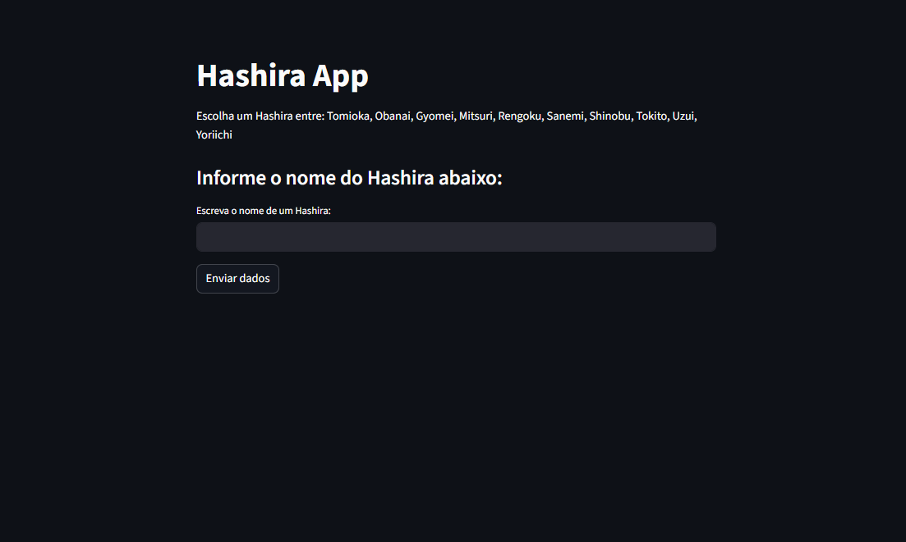
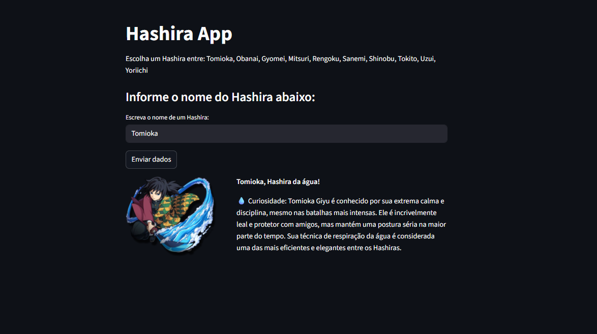

# 🧑‍💻 Primeiro contato com Streamlit

Este repositório contém um projeto simples e poderoso desenvolvido em **Streamlit**, fruto de uma aula da faculdade.
A ideia foi aplicar os conceitos e lógicas que venho aprendendo na minha jornada de programação para criar uma aplicação interativa.

E para deixar tudo mais divertido, escolhi um tema especial:
👉 Você já assistiu **Demon Slayer: Kimetsu no Yaiba**?
Caso não, sem problemas! A aplicação vai te apresentar os **Hashiras**, os espadachins mais fortes dessa obra.

---

## 🚀 Tecnologias utilizadas

* [Python](https://www.python.org/)
* [Streamlit](https://streamlit.io/)

---

## 📂 Estrutura do projeto

```
📦 ProjetoHashiras
 ┣ 📂 Hashiras/        # imagens dos personagens
 ┣ 📂 screenshots/     # prints da aplicação
 ┣ 📜 CodAula.py       # código base usado na aula
 ┣ 📜 MyApplication.py # aplicação principal
 ┣ 📜 requirements.txt # dependências do projeto
 ┗ 📜 README.md
```

---

## ▶️ Como rodar o projeto

1. Clone o repositório:

   ```bash
   git clone https://github.com/seu-usuario/ProjetoHashiras.git
   cd ProjetoHashiras
   ```

2. Crie e ative um ambiente virtual (opcional, mas recomendado):

   ```bash
   python -m venv .venv
   .venv\Scripts\activate     # Windows
   source .venv/bin/activate  # Linux/Mac
   ```

3. Instale as dependências:

   ```bash
   pip install -r requirements.txt
   ```

4. Rode a aplicação:

   ```bash
   streamlit run MyApplication.py
   ```

5. Abra no navegador o endereço que o Streamlit mostrar (geralmente `http://localhost:8501`).

---

## ✨ Resultado

A aplicação permite que você digite o nome de um Hashira e veja curiosidades sobre cada um deles, acompanhadas de imagens ilustrativas.
É um primeiro passo no uso do Streamlit, unindo aprendizado com diversão!

### 📸 Prints da aplicação

Tela inicial:


Exemplo de Hashira exibido:


---

## 📜 Licença

Este projeto foi criado apenas para fins educacionais.
Sinta-se à vontade para usar como referência.
